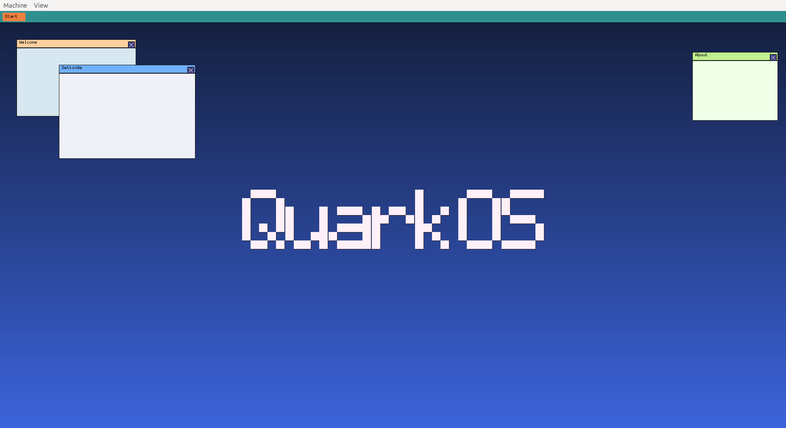
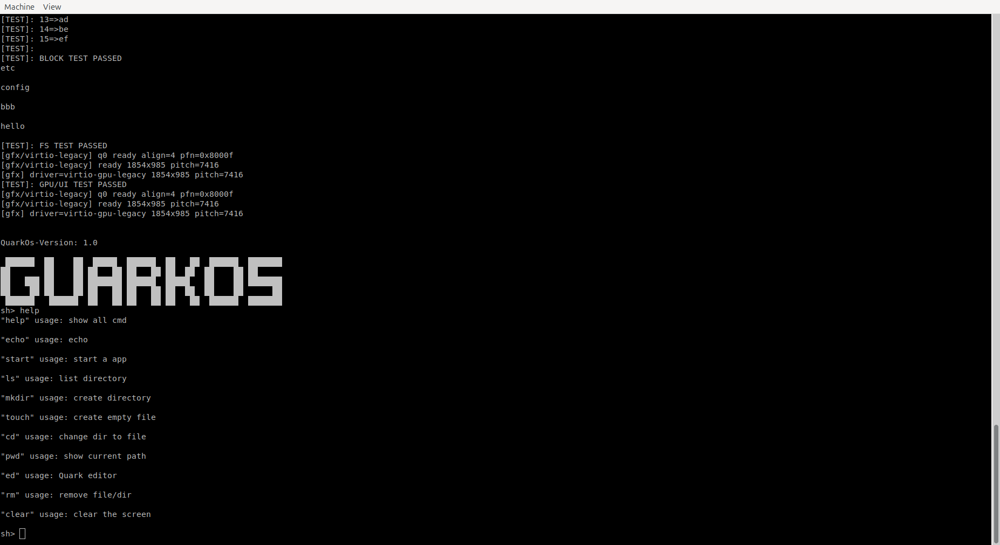

# QuarkOS

<p align="center">
  
</p>

## 1 Graph SUPPORT

### 1.1 Graph



### 1.2 Terminal



## 2 Usage

### 2.1 App

#### 2.1.1 Add by your self

step1: add your app in `app/app.h`

```c
static struct shell_app app_table[] = {
    {"app1", app1_entry, "example"},
    ...
    {NULL, NULL, NULL}
};
```

step2: code in dir `app/`, such as `app.c`.

```c
// you should include `shell.h` and `app.h`
#include "shell.h"
#include "app.h"

// entry relative to `app_table[]`
void app1_entry(void *arg) {
    SHELL_PRINTF("App1 running!\r\n");
}
```

#### 2.1.2 Add by script

```bash
./app_helper add <app_name>
```

you can also delete the app

```bash
./app_helper del <app_name>
```

#### 2.1.3 Desktop App

You can see public api in user/ui/desktop `apps`.

for example, you just do same as `app3`.

we also support app logo generation.

you can use `src/tools/icon2c.py` to finish it.

## 3 Debug

step1: Compile and debug version

```bash
make BUILD_TYPE=debug
```
step2: Starting a debugging session

terminal1

```bash
make debug
```

terminal2

```bash
make gdb
```

## 4 Release

```bash
make run
```