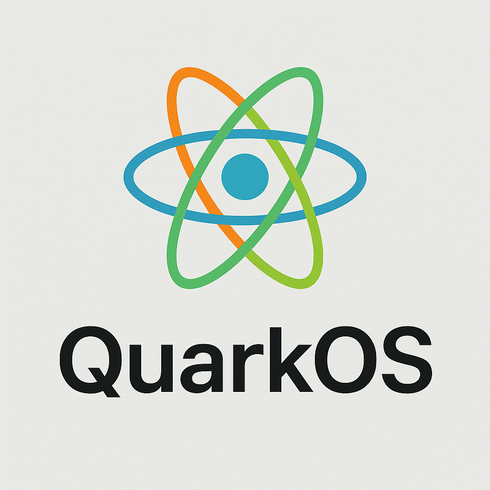

# QuarkOS

<p align="center">
  
</p>

## 1 Graph SUPPORT

QuarkOS is an experimental operating system for the **RISC-V** architecture. It
provides a clean and modular codebase that targets education, research and
hobbyist use.

## Features

- Graphical desktop with basic window and icon support
- Integrated terminal and shell
- Pluggable application framework
- Simple multi-user management
- GNU Make based build system

### Graphical Interface


### Terminal


### 2.1 App

## Roadmap

The project is under active development. Upcoming milestones include:

- ✅ Initial graphics and shell implementation
- ✅ Basic app framework and user management
- ✅ Persistent file system
- ⬜ Networking stack and internet utilities
- ⬜ Support for additional RISC-V boards

## Getting Started

### Prerequisites

- RISC-V GNU cross toolchain (e.g. `riscv64-unknown-elf-gcc`)
- `qemu-system-riscv64`
- Python 3 for helper scripts

### Build and Run

```bash
make run # build and launch QuarkOS in QEMU
```

For a debug build:

```bash
make BUILD_TYPE=debug
make debug # terminal 1: start QEMU in debug mode
make gdb # terminal 2: attach the debugger
```

## Application Development

### Manual method

1. Register the app in `app/app.h`:

    ```c
    static struct shell_app app_table[] = {
        {"app1", app1_entry, "example"},
        /* ... */
        {NULL, NULL, NULL},
    };
    ```

2. Implement the app in `app/<app>.c`:

    ```c
    #include "shell.h"
    #include "app.h"

    void app1_entry(void *arg) {
        SHELL_PRINTF("App1 running!\\r\\n");
    }
    ```

### Using the helper script

```bash
./app_helper add <app_name>   # create skeleton
./app_helper del <app_name>   # remove app
```

### Desktop applications

APIs for desktop apps live under `user/ui/desktop/apps`. Generate icon assets
with:

```bash
python3 src/tools/icon2c.py <png> <output.c>
```

## User Management

```bash
users # list current users
whoami # show the active user
adduser # interactively add a new user
```

## Debugging

```bash
make BUILD_TYPE=debug
make debug # terminal 1
make gdb # terminal 2
```

## Release Builds

```bash
make BUILD_TYPE=release run
```

## Contributing

Contributions, issues and feature requests are welcome. Feel free to check the
issues page or submit a pull request.

---

# QuarkOS（中文）

<p align="center">
  
</p>

QuarkOS 是一款面向 **RISC-V** 架构的实验性操作系统，
为教学、科研以及爱好者提供简洁且模块化的代码基础。

## 功能

- 带有基础窗口和图标支持的图形桌面
- 集成终端和 Shell
- 可插拔的应用框架
- 简单的多用户管理
- 基于 GNU Make 的构建系统

### 图形界面


### 终端


## 规划路线

项目正处于积极开发阶段，后续计划包括：

- ✅ 初始图形和 Shell 实现
- ✅ 基本的应用框架和用户管理
- ✅ 持久化文件系统
- ⬜ 网络协议栈与相关工具
- ⬜ 支持更多 RISC-V 开发板

## 快速开始

### 前置条件

- RISC-V GNU 交叉编译工具链（如 `riscv64-unknown-elf-gcc`）
- `qemu-system-riscv64`
- Python 3（用于辅助脚本）

### 构建与运行

```bash
make run # 构建并在 QEMU 中运行 QuarkOS
```

调试构建：

```bash
make BUILD_TYPE=debug
make debug # 终端1：以调试模式启动 QEMU
make gdb # 终端2：附加调试器
```

## 应用开发

### 手动方式

1. 在 `app/app.h` 中注册应用：

```c
static struct shell_app app_table[] = {
    {"app1", app1_entry, "example"},
    /* ... */
    {NULL, NULL, NULL},
};
```

2. 在 `app/app1.c` 中实现应用：

```c
#include "shell.h"
#include "app.h"

void app1_entry(void *arg) {
    SHELL_PRINTF("App1 running!\\r\\n");
}
```

### 使用辅助脚本

```bash
./app_helper add <app_name>   # 创建应用骨架
./app_helper del <app_name>   # 删除应用
```

### 桌面应用

桌面应用的 API 位于 `user/ui/desktop/apps`。
生成图标资源：

```bash
python3 src/tools/icon2c.py <png> <output.c>
```

## 用户管理

```bash
users      # 列出当前用户
whoami     # 显示当前用户
adduser    # 交互式添加新用户
```

## 调试

```bash
make BUILD_TYPE=debug
make debug # 终端1
make gdb        # 终端2
```

## 发布构建

```bash
make BUILD_TYPE=release run
```

## 贡献

欢迎提交贡献、问题和功能请求。可查看 issue 页面或提交 pull request。